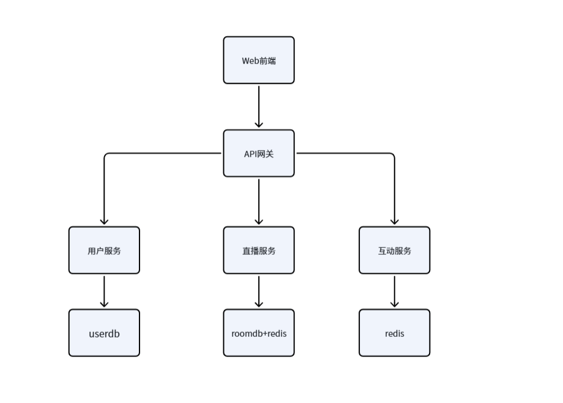

# 简播(SimpleLive)系统架构设计文档

## 概述与背景

随着直播需求的轻量化，本项目旨在构建一个 Web 端简易开播平台（简播 V1.0）。 本文档旨在确立简播 V1.0 后端系统的整体架构、微服务划分、核心流转机制及数据存储方案。系统将采用基于 .NET 生态的微服务架构，参考微软 eShop 经典架构模式，以确保系统具备良好的可扩展性、高可用性和清晰的业务边界。

### 核心设计目标

**业务支撑：**用户、直播间、弹幕互动、第三方推流等核心功能

**高内聚低耦合：**采用DDD思想划分微服务，通过异步事件总线(EventBus)实现集成事件，达成解耦的目的

**高并发互动支撑：**针对弹幕等高频写入场景，提供平滑的接入层与消息分发机制

**现代化云原生编排：**利用.NET Aspire统一管理依赖资源(Redis,DB,RabbitMQ)与服务编排，提升本地开发与诊断体验

## 总体架构设计

系统采用经典的API网关+后端微服务+异步事件总线的架构

### 系统架构图



```
graph LR
    %% 客户端层
    Client[浏览器/观众/主播] -->|HTTP/WebSocket| YARP[YARP API Gateway]
    OBS[OBS等推流工具] -->|RTMP推流| MediaServer[流媒体服务器SRS/ZLM]
    
    %% 网关路由
    YARP -->|/api/user| UserAPI(Identity.API)
    YARP -->|/api/room| RoomAPI(LiveRoom.API)
    YARP -->|/hub/chat| ChatAPI(Interaction.API)
    
    %% 服务间异步通信
    RoomAPI -.->|Publish Event| EventBus((EventBus RabbitMQ))
    ChatAPI -.->|Subscribe| EventBus
    
    %% 流媒体回调
    MediaServer -->|Webhook Callback| RoomAPI
    
    %% 基础设施层
    UserAPI --> PG_User[(PostgreSQL: User)]
    RoomAPI --> PG_Room[(PostgreSQL: Room)]
    RoomAPI --> Redis_Room[(Redis: RoomState)]
```

### 核心技术选型与推演

#### API网关：YARP

- **为什么不用客户端直连微服务?**微服务架构下，后端被拆成多个API。如果不加网关，前端需要维护多个基地址，且跨域(CORS)、鉴权、限流等横切关注点需要在每个微服务里重复写一遍
- **为什么选YARP？**它是微软官方出品的高度可定制的反向代理，完美契合 .NET Core 中间件管道。相比于 Nginx，YARP 允许我们直接用 C# 代码编写路由规则、动态负载均衡，并能轻松与 Identity 服务集成做统一鉴权

#### 服务编排与诊断：.NET Aspire

- **为什么使用Aspire？**如果微服务一多，本地启动要拉多个控制台、Docker容器。Aspire充当了AppHost，一键拉起所有 .NET 服务以及依赖的 Redis、RabbitMQ、PostgreSQL 容器。更重要的是，它开箱即用了 OpenTelemetry（链路追踪），方便我们排查“网关 -> 房间服务 -> 事件总线 -> 互动服务”这条长链路到底卡在哪里

#### 微服务间解耦：EventBus(RabbitMQ)

- **为什么不用 HTTP 互调？** 一个微服务直接调用另一个微服务，若那个微服务宕机，会导致本微服务也宕机，从而导致**服务雪崩效应**，这是不合理的强耦合

- **设计方案：**引入 EventBus 集成事件（Integration Events）。这保证了核心链路的高可用

#### 实时通信：SignalR

- **为什么选 SignalR？** 弹幕和聊天属于双向高频通信。SignalR 是 .NET 下最成熟的方案，它自动协商 WebSocket、Server-Sent Events 或 Long Polling，并且支持横向扩展（搭配 Redis Backplane）

## DDD界限上下文划分

| 界限上下文(微服务)               | 核心职责                                                     | 独占数据存储         |
| -------------------------------- | ------------------------------------------------------------ | -------------------- |
| **User.API** (用户上下文)        | 注册、登录、JWT 颁发、个人基础信息维护                       | userdb(PGSQL)        |
| **LiveRoom.API** (直播间上下文)  | 房间创建、开播/关播状态流转、推流凭证校验（Webhook 接收）、直播列表 | roomdb (PG) + Redis  |
| **Interaction.API** (互动上下文) | 建立 WebSocket 连接、弹幕广播、实时在线人数统计              | Redis (暂不需持久化) |

**架构约束：**任何微服务严禁直接连接其他微服务的数据库。必须通过 API 或 EventBus 进行数据交互


## 核心业务流转设计

### 第三方推流与状态流转

```
sequenceDiagram
    autonumber
    participant OBS
    participant MS as 媒体服务器 (SRS)
    participant LR as LiveRoom.API
    participant EB as EventBus
    participant Chat as Interaction.API

    OBS->>MS: 发起 RTMP 推流 (附带推流码)
    MS->>LR: 异步 Webhook (on_publish)
    LR->>LR: 校验推流码是否合法
    alt 凭证无效
        LR-->>MS: 拒绝接入 (HTTP 401/403)
        MS-->>OBS: 断开连接
    else 凭证有效
        LR->>LR: 更新数据库 & Redis (状态设为 Live)
        LR-->>MS: 允许接入 (HTTP 200)
        MS->>OBS: 开始接收推流
        LR->>EB: 发布 LiveRoomStartedIntegrationEvent
        EB->>Chat: 接收开播事件
        Chat->>Chat: 初始化直播间聊天频道
    end
```

**设计关键点说明：**

- 媒体服务器（如 SRS）属于 C/C++ 领域，性能极高，负责处理沉重的视频流。

- 我们的 C# 业务后端 **绝对不碰视频流**，只处理信令与回调（Webhook）。

- 防网络抖动设计：针对 PRD 提到的“断开连接超过 30 秒才判定关播”，可以在 LiveRoom.API 内部引入延迟队列机制（如 Hangfire 或 RabbitMQ 的延迟死信队列），收到 `on_unpublish` 后不立刻关播，而是发送一个 30s 的延迟任务，如果 30s 内又收到了 `on_publish`，则取消关播动作。

## 数据与并发设计

**直播列表获取削峰：**用户打开首页请求直播列表，直接查 PostgreSQL 会导致数据库连接池被打满

- **策略：**LiveRoom.API 在更新房间状态时，同步维护一份数据在 Redis 中（如 SortedSet，以观众人数排序）。首页 API 直接从 Redis 读取返回

**在线人数统计：**

- **策略：**客户端建立 SignalR 连接时，Interaction.API 在 Redis 中对该房间的在线人数执行 `INCR` 操作；断开连接执行 `DECR` 操作。房间热度无需精确到个位，前端可设置 5-10 秒定时拉取一次


## 内部结构与领域模型

各个微服务采用严格的分层架构，以"LiveRoom"为例，包含以下工程：

* **LiveRoom.Domain:**核心业务模型层，包含'Room'聚合根，无任何外部框架依赖
* **LiveRoom.Infrastructure：**应用逻辑与基础设施层
* **LiveRoom.API:**提供HTTP/REST端点并集成Aspire监控

```
以下文件夹均为解决方案文件夹
实体放到entities文件夹下：
Domain
	entities
		实体
	DomainEvent(文件夹)(充血模型发布事件用)
	IxxRepository
	xxDomainService
Infrastructure
	Configs
		EF实体配置
	Service(文件夹)(将一些蕴含复杂逻辑的代码放到这里面)
	xxRepository(继承IxxRepository)	
	xxDbContext
API
	Controllers
		Request
			请求实体xxx
		Response
			响应实体xxx
		xxController
	Events(文件夹)

将一些微服务公用的放到解决方案文件夹Common下，在Common下创建公共模块。例如：EventBus等等
项目总体文件夹目录结构为：
解决方案文件夹：
Solutions Items
src
	Commons(文件夹)
		EventBus(模块)
		EventBusRabbitMQ
		IntegrationEventLogEF
		DomainCommons
	LiveRoom(文件夹)
		LiveRoom.Domain
		LiveRoom.Infrastructure
		LiveRoom.API
	User(文件夹)
		User.Domain
		User.Infrastructure
		User.API
	Interaction(文件夹)
		Interaction.Domain
		Interaction.Infrastructure
		Interaction.API
tests


核心聚合根设计(充血模型)
例：Room
Id
HostId
Title
StreamKey
RoomStatus		[Enum: Offline, PreParing, Live, Ended]
LastHeartbeat	[DateTime]
void EndLive()
void ResetStreamKey()等等方法
```

内部结构大体上上上面这样的结构，看情况增加Extensions文件夹和Exceptions文件夹或者Event文件夹(创建DomainEvent领域事件、IntegrationEvent集成事件)


### 实体结构

User：

```c#
//继承Identity<Guid>
public string NickName { get; private set; }//用户名称
public string? AvatarUrl { get; private set; }
public DateTime? DateOfBirth { get; private set; }
public GenderType Gender { get; private set; } = GenderType.Unknown;
public string? Location { get; private set; }
public string? Signature { get; private set; }
    
public int FollowingCount { get; private set; } = 0;//关注数
public int FollowerCount { get; private set; } = 0;//粉丝数
    
public DateTime CreationTime { get; private set; }
public DateTime? UpdationTime { get; private set; }

public enum GenderType
{
    Unknown = 0,
    Male = 1,
    Female = 2
}
```

Room

```c#
private Guid Id;
private string RoomNumber;//房间号

public Guid HostId { get; private set; } // 主播User ID
public string HostUserName { get; private set; } // 冗余：主播昵称
public string? HostAvatarUrl { get; private set; } // 冗余：主播头像

public string Title { get; private set; } // 直播间标题
public string? CoverImageUrl { get; private set; } // 直播封面，放到静态资源服务器上

public string StreamKey { get; private set; } // 推流码 (供SRS验证)
public RoomStatus Status { get; private set; } // 状态机枚举：Offline, Preparing, Live, Ended

public DateTime CreationTime { get; private set; }
public DateTime? UpdationTime { get; private set; }
```

Interaction

```c#
//不存数据库
// 弹幕消息结构 (通过 WebSocket 发给前端，无需存 PGSQL)
public class DanmakuMessage
{
    public string RoomId { get; set; }
    public string SenderId { get; set; }
    public string SenderName { get; set; } // 谁发的
    public string Content { get; set; } // 弹幕内容 (最多30字)
    public DateTime SendTime { get; set; } = DateTime.UtcNow;
}

// 在线人数结构 (存在 Redis 的 Key-Value 里)
// Redis Key: "room:{RoomId}:online_count"
// Value: int (使用 Redis 的 INCR/DECR 指令操作)
```

Fluent API配置

```c#
//User
public class UserConfiguration : IEntityTypeConfiguration<User>
{
    public void Configure(EntityTypeBuilder<User> builder)
    {
       // 1. 表名重命名
        // Identity 默认会把用户表命名为 "AspNetUsers"
        // 通过这里我们可以把它强制改回我们想要的 "T_Users"
        builder.ToTable("T_Users");

        // 注意：不要再配置 builder.HasKey(u => u.Id); 
        // 父类底层已经配过了！

        // 2. 核心业务扩展字段配置
        // NickName 显示昵称：必填，限制长度
        builder.Property(u => u.NickName)
               .IsRequired()
               .HasMaxLength(50);

        // 3. 可选信息字段配置
        builder.Property(u => u.AvatarUrl)
               .HasMaxLength(500);

        builder.Property(u => u.Location)
               .HasMaxLength(100);

        builder.Property(u => u.Signature)
               .HasMaxLength(200);

        // DateOfBirth 不需要配置 MaxLength，数据库中会自动映射为 timestamp / datetime 类型

        // 4. 枚举配置
        // 推荐将枚举在数据库中存为 Int 类型（占用空间小，查询快）
        // EF Core 默认就会把 Enum 映射为 Int，所以这行可以省略，但写出来语义更清晰
        builder.Property(u => u.Gender)
               .HasConversion<int>();

        // 5. 统计与时间字段
        builder.Property(u => u.FollowingCount)
               .HasDefaultValue(0);
               
        builder.Property(u => u.FollowerCount)
               .HasDefaultValue(0);

        builder.Property(u => u.CreationTime)
               .IsRequired();
    }
}

//Room
public class LiveRoomConfiguration : IEntityTypeConfiguration<LiveRoom>
{
    public void Configure(EntityTypeBuilder<LiveRoom> builder)
    {
        // 1. 指定表名
        builder.ToTable("T_LiveRooms");

        // 2. 设置主键
        builder.HasKey(r => r.Id);

        // 3. 房间号与推流码的极端性能优化
        // RoomNumber 房间号：观众搜索时的高频字段，必须建唯一索引
        builder.Property(r => r.RoomNumber)
               .IsRequired()
               .HasMaxLength(20);
        builder.HasIndex(r => r.RoomNumber)
               .IsUnique(); 

        // StreamKey 推流码：【极其重要】SRS回调鉴权时，是根据它来查房间的！
        // 如果不建索引，每次推流验证都会全表扫描，严重拖垮性能。
        builder.Property(r => r.StreamKey)
               .IsRequired()
               .HasMaxLength(128);
        builder.HasIndex(r => r.StreamKey)
               .IsUnique();

        // 4. 冗余字段配置
        // HostId：为了方便查“某个人开过哪些直播”，建个普通索引
        builder.Property(r => r.HostId).IsRequired();
        builder.HasIndex(r => r.HostId);

        builder.Property(r => r.HostUserName)
               .IsRequired()
               .HasMaxLength(50);

        builder.Property(r => r.HostAvatarUrl)
               .HasMaxLength(500);

        // 5. 房间元数据
        builder.Property(r => r.Title)
               .IsRequired()
               .HasMaxLength(100);

        builder.Property(r => r.CoverImageUrl)
               .HasMaxLength(500);

        // 6. 状态机映射
        // PGSQL 中推荐将 Enum 映射为 String 或 Int。
        // 这里为了查询速度和节省空间，默认存为 Int。
        builder.Property(r => r.Status)
               .IsRequired()
               // 如果你想在数据库里直观看到 "Live" 字母而不是数字 2，可以取消下面这行的注释：
               // .HasConversion<string>() 
               ;

        builder.Property(r => r.CreationTime)
               .IsRequired();
    }
}
```


## 详细的业务逻辑

### User

- 注册：用户可以根据UserName或者Email邮箱注册账户，UserName的规则是至少八位，最多二十位，最少包含数字和字母，并且必须以字母或数字开头。密码的规则是至少八位，必须包含数字和字母，也是允许使用特殊字符(不强制)
- 登录：根据用户名和密码去跟数据库进行分析，如果数据库存在这个用户就登录成功，并颁发JWT令牌
- 资料显示：显示用户头像、昵称、年龄、性别、所在地、个性签名
- 资料修改：修改新昵称、个性签名、性别、生日、所在地

- 关注的主播数显示：关注数
- 订阅的粉丝数显示：粉丝数(用于主播显示已被多少人关注，给主播和用户看)
